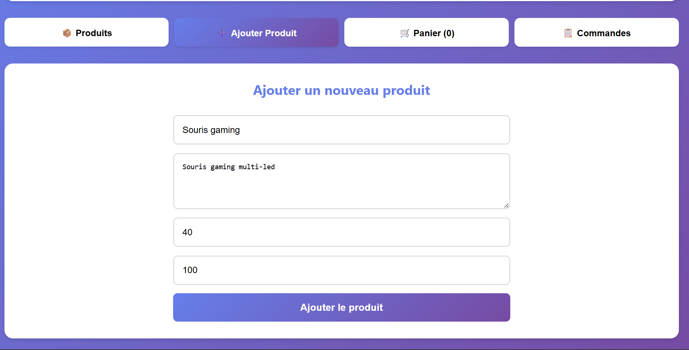
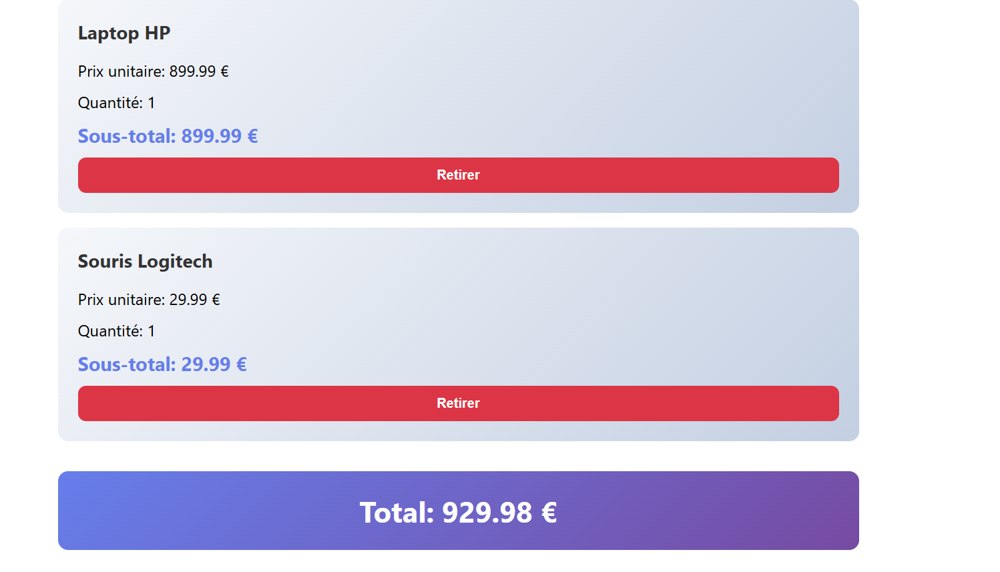
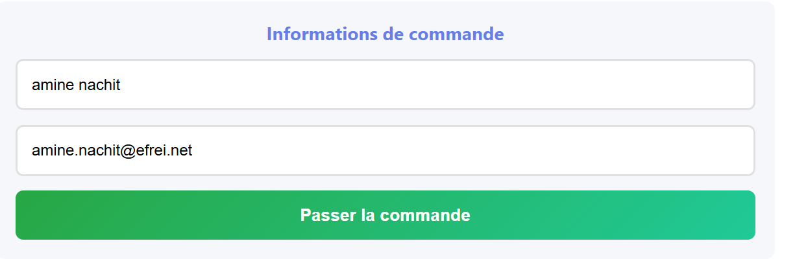

# Rapport de Projet - Application E-Commerce Microservices

**Cours:** Intégration Cloud
**École:** EFREI
**Date:** Janvier 2026

---

## 1. Présentation du Projet

### 1.1 Description

Application e-commerce complète basée sur une architecture microservices, déployée sur Kubernetes. L'application permet de gérer des produits, passer des commandes, et visualiser l'historique via une interface web React.

### 1.2 Technologies Utilisées

| Composant | Technologie |
|-----------|-------------|
| Backend | Python FastAPI 0.109 + SQLAlchemy |
| Frontend | React 18 + Nginx |
| Base de données | PostgreSQL 15 |
| Conteneurisation | Docker |
| Orchestration | Kubernetes + Nginx Ingress |

### 1.3 Architecture

```
        Nginx Ingress (Gateway)
                 │
    ┌────────────┼────────────┐
    │            │            │
Frontend    Product     Order
(React)     Service    Service
             │            │
             └─────┬──────┘
                   │
              PostgreSQL
```

**Services:**
- **Product Service** (FastAPI): CRUD produits + validation stocks (2 réplicas)
- **Order Service** (FastAPI): Gestion commandes + communication inter-services (2 réplicas)
- **Frontend** (React): Interface utilisateur avec panier d'achat (2 réplicas)
- **PostgreSQL**: Base de données avec persistance (PVC)

---

## 2. Docker - Conteneurisation

### 2.1 Images Docker

Trois images Docker créées et publiées sur Docker Hub:
- `username/product-service:latest`
- `username/order-service:latest`
- `username/frontend:latest`

**[CAPTURE 1: Terminal montrant `docker build` et `docker push` pour les 3 services]**

---


****

---

## 3. Kubernetes - Déploiement

### 3.1 Ressources Déployées

| Type | Quantité | Description |
|------|----------|-------------|
| Deployments | 4 | PostgreSQL, Product (×2), Order (×2), Frontend (×2) |
| Services | 4 | ClusterIP pour chaque composant |
| Ingress | 1 | Nginx Ingress avec règles de routage |
| ConfigMap | 1 | Configuration PostgreSQL |
| PVC | 1 | Persistance PostgreSQL |

### 3.2 Déploiement et Vérification

**[CAPTURE 3: Terminal - Installation Nginx Ingress Controller]**

```bash
kubectl apply -f https://raw.githubusercontent.com/kubernetes/ingress-nginx/...
```

---

**[CAPTURE 4: Terminal - Déploiement complet avec `kubectl get all`]**

Montre tous les pods (running), services, deployments et réplicas.

---

**[CAPTURE 5: Terminal - Ingress configuré avec `kubectl get ingress` et `kubectl describe ingress`]**

---

## 4. Application Web - Tests Fonctionnels

### 4.1 Interface Frontend

**[CAPTURE 6: Page d'accueil - Liste des produits avec prix et stocks]**

URL: http://localhost:3000 (local) ou http://ecommerce.local (Kubernetes)

---

**[CAPTURE 7: Ajout d'un produit - Formulaire rempli]**


---

**[CAPTURE 8: Panier d'achat avec articles et total]**


---

**[CAPTURE 9: Création d'une commande - Formulaire client + confirmation]**


---

**[CAPTURE 10: Historique des commandes avec détails]**


---

## 5. Tests APIs et Communication

### 5.1 Tests des APIs REST

**[CAPTURE 11: Test API - GET /products/ et POST /orders/ (Postman ou curl)]**

Démontre les réponses JSON des deux microservices.

---

### 5.2 Haute Disponibilité et Communication Inter-Services

**[CAPTURE 12: Terminal - `kubectl get pods -o wide` montrant 2 réplicas par service + logs de communication entre Order et Product Service]**

---

## 6. Bilan du Projet

### 6.1 Critères d'Évaluation

| Critère | Implémentation | Note Visée |
|---------|----------------|------------|
| Web Services Python | 2 microservices FastAPI complets avec CRUD | 16/20 |
| Docker | 3 images construites et publiées sur Docker Hub | 16/20 |
| Kubernetes | 11 manifests avec deployments, services, ingress, PVC | 16/20 |
| Gateway | Nginx Ingress avec règles de routage | 18/20 |
| Base de données | PostgreSQL avec persistance et 3 tables | 18/20 |
| Frontend | Application React moderne et responsive | 18/20 |
| Communication | Communication inter-services HTTP fonctionnelle | 18/20 |

**Note globale visée: 16-18/20**

### 6.2 Fonctionnalités Réalisées

**Backend:**
- ✅ APIs REST complètes (CRUD)
- ✅ Communication HTTP entre services
- ✅ Validation données (Pydantic)
- ✅ ORM SQLAlchemy
- ✅ Health checks (liveness/readiness)

**Infrastructure:**
- ✅ Multi-conteneurs Docker
- ✅ Réplication (2 réplicas par service)
- ✅ Load balancing automatique
- ✅ Persistance données (PVC)
- ✅ Gateway Ingress

**Frontend:**
- ✅ Interface React complète
- ✅ Gestion panier d'achat
- ✅ Communication APIs
- ✅ Design CSS responsive

---

## 7. Déploiement

### 7.1 Commandes Principales

```bash
# Construction des images Docker
docker build -t username/product-service:latest ./product-service
docker build -t username/order-service:latest ./order-service
docker build -t username/ecommerce-frontend:latest ./frontend

# Publication sur Docker Hub
docker push username/product-service:latest
docker push username/order-service:latest
docker push username/ecommerce-frontend:latest

# Déploiement Kubernetes
kubectl apply -f kubernetes/

# Configuration hosts
echo "127.0.0.1 ecommerce.local" >> /etc/hosts
```

### 7.2 URLs d'Accès

- **Application:** http://ecommerce.local
- **Product API:** http://ecommerce.local/api/products/
- **Order API:** http://ecommerce.local/api/orders/

---

## 8. Conclusion

Ce projet démontre une implémentation complète d'une architecture microservices moderne avec:
- **Architecture découplée** et scalable
- **Conteneurisation** complète avec Docker
- **Orchestration** Kubernetes avec haute disponibilité
- **Gateway** Nginx Ingress pour le routage
- **Persistance** des données avec PostgreSQL
- **Interface utilisateur** React moderne

### Compétences Acquises
- Développement microservices (FastAPI)
- Conteneurisation et orchestration
- Networking Kubernetes
- Communication inter-services
- Déploiement d'applications cloud-native

---

## Annexe - Structure du Projet

```
projet_cloud/
├── product-service/          # Microservice produits
│   ├── app/main.py          # API FastAPI
│   └── Dockerfile
├── order-service/           # Microservice commandes
│   ├── app/main.py          # API FastAPI + communication
│   └── Dockerfile
├── frontend/                # Interface React
│   ├── src/App.js
│   ├── nginx.conf           # Reverse proxy
│   └── Dockerfile
├── kubernetes/              # 11 manifests K8s
│   ├── *-deployment.yaml
│   ├── *-service.yaml
│   └── ingress.yaml
├── database/init.sql
├── docker-compose.yml       # Test local
└── README.md               # Documentation

```

**Références:**
- FastAPI: https://fastapi.tiangolo.com/
- Kubernetes: https://kubernetes.io/docs/
- GitHub cours: https://github.com/charroux/kubernetes-minikube

---

**Fin du rapport**
