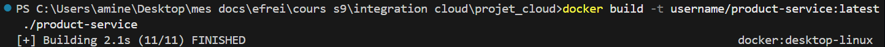
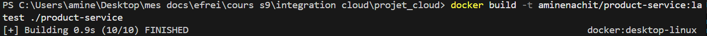
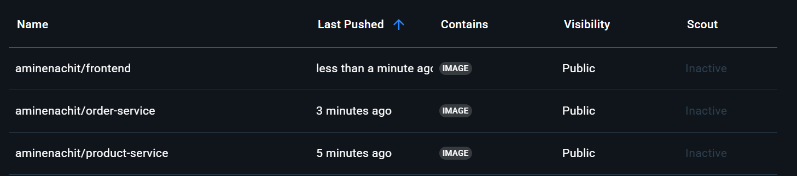
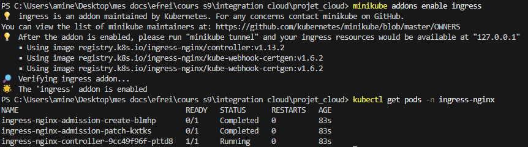
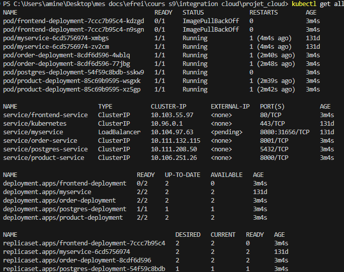
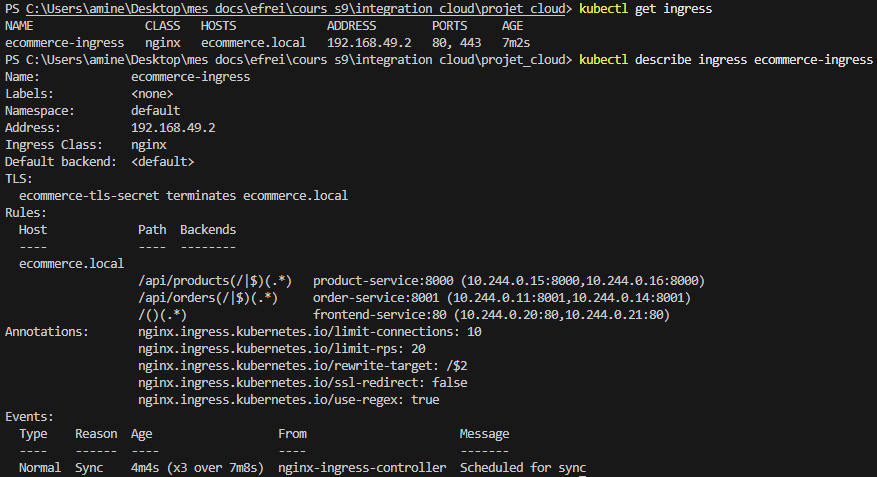
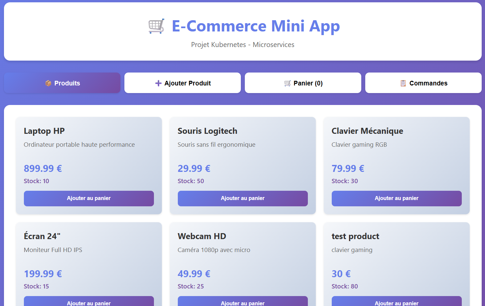

# Rapport de Projet - Application E-Commerce Microservices

**Cours:** Intégration Cloud
**École:** EFREI
**Date:** Janvier 2026

---

## 1. Présentation du Projet

### 1.1 Description

Application e-commerce complète basée sur une architecture microservices, déployée sur Kubernetes. L'application permet de gérer des produits, passer des commandes, et visualiser l'historique via une interface web React.

### 1.2 Technologies Utilisées

| Composant | Technologie |
|-----------|-------------|
| Backend | Python FastAPI 0.109 + SQLAlchemy |
| Frontend | React 18 + Nginx |
| Base de données | PostgreSQL 15 |
| Conteneurisation | Docker |
| Orchestration | Kubernetes + Nginx Ingress |
| Infrastructure as Code | Terraform (GCP/GKE) |
| Sécurité | NetworkPolicies, RBAC, TLS, Secrets, Rate Limiting |

### 1.3 Architecture

```
        Nginx Ingress (Gateway)
                 │
    ┌────────────┼────────────┐
    │            │            │
Frontend    Product     Order
(React)     Service    Service
             │            │
             └─────┬──────┘
                   │
              PostgreSQL
```

**Services:**
- **Product Service** (FastAPI): CRUD produits + validation stocks (2 réplicas)
- **Order Service** (FastAPI): Gestion commandes + communication inter-services (2 réplicas)
- **Frontend** (React): Interface utilisateur avec panier d'achat (2 réplicas)
- **PostgreSQL**: Base de données avec persistance (PVC)

---

## 2. Docker - Conteneurisation

### 2.1 Images Docker

Trois images Docker créées et publiées sur Docker Hub:
- `aminenachit/product-service:latest`
- `aminenachit/order-service:latest`
- `aminenachit/frontend:latest`

**[CAPTURE 1: Terminal montrant `docker build` et `docker push` pour les 3 services]**

---


****

---

## 3. Kubernetes - Déploiement

### 3.1 Ressources Déployées

| Type | Quantité | Description |
|------|----------|-------------|
| Deployments | 4 | PostgreSQL, Product (×2), Order (×2), Frontend (×2) |
| Services | 4 | ClusterIP pour chaque composant |
| Ingress | 1 | Nginx Ingress avec règles de routage |
| ConfigMap | 1 | Configuration PostgreSQL |
| PVC | 1 | Persistance PostgreSQL |

### 3.2 Déploiement et Vérification

**[CAPTURE 3: Terminal - Installation Nginx Ingress Controller]**

```bash
kubectl apply -f https://raw.githubusercontent.com/kubernetes/ingress-nginx/...
```

---

**[CAPTURE 4: Terminal - Déploiement complet avec `kubectl get all`]**

Montre tous les pods (running), services, deployments et réplicas.

---

**[CAPTURE 5: Terminal - Ingress configuré avec `kubectl get ingress` et `kubectl describe ingress`]**


---

## 4. Application Web - Tests Fonctionnels

### 4.1 Interface Frontend


**[CAPTURE 6: Page d'accueil - Liste des produits avec prix et stocks]**

URL: http://localhost:3000 (local) ou http://ecommerce.local (Kubernetes)

---

**[CAPTURE 7: Ajout d'un produit - Formulaire rempli]**


---

**[CAPTURE 8: Panier d'achat avec articles et total]**


---

**[CAPTURE 9: Création d'une commande - Formulaire client + confirmation]**


---

**[CAPTURE 10: Historique des commandes avec détails]**


---

## 5. Terraform - Infrastructure as Code (GCP)

### 5.1 Architecture Cloud

Le déploiement cloud est provisionné via **Terraform** sur **Google Cloud Platform (GKE)**.

```
terraform/
├── main.tf                  # Cluster GKE, VPC, Firewall, IP statique
├── variables.tf             # Variables paramétrables
├── outputs.tf               # Sorties (endpoint, IP, commande kubectl)
└── terraform.tfvars.example # Exemple de configuration
```

### 5.2 Ressources provisionnées

| Ressource Terraform | Description |
|---------------------|-------------|
| `google_compute_network` | VPC dédié avec sous-réseaux séparés |
| `google_compute_subnetwork` | Sous-réseau avec ranges IP pour pods et services |
| `google_container_cluster` | Cluster GKE avec Network Policy activé |
| `google_container_node_pool` | Node pool avec autoscaling (1-4 nœuds) |
| `google_compute_firewall` | Règles firewall (HTTP/HTTPS + trafic interne) |
| `google_compute_global_address` | IP statique pour l'Ingress |

### 5.3 Commandes de déploiement

```bash
# Initialiser Terraform
cd terraform/
cp terraform.tfvars.example terraform.tfvars
# Éditer terraform.tfvars avec votre project_id GCP

terraform init
terraform plan      # Prévisualiser les changements
terraform apply     # Provisionner l'infrastructure

# Configurer kubectl pour le cluster GKE
gcloud container clusters get-credentials ecommerce-cluster \
  --zone europe-west1-b --project mon-projet-gcp

# Déployer les manifests Kubernetes
kubectl apply -f ../kubernetes/
```

### 5.4 Points clés

- **VPC isolé** avec sous-réseaux dédiés (pods, services)
- **Autoscaling** des nœuds (1 à 4 nœuds e2-medium)
- **Auto-repair et auto-upgrade** activés
- **Monitoring et logging** GCP intégrés
- **Firewall** restrictif (HTTP/HTTPS uniquement depuis l'extérieur)

---

## 6. Sécurisation du Cluster Kubernetes

### 6.1 Network Policies

Isolation réseau stricte entre les pods. Chaque service ne peut communiquer qu'avec les services autorisés.

```
kubernetes/security/network-policies.yaml
```

| Politique | Règle |
|-----------|-------|
| `default-deny-ingress` | Bloque tout trafic entrant par défaut |
| `postgres-allow-services` | PostgreSQL accepte uniquement product-service et order-service |
| `product-service-policy` | Product Service accepte depuis Ingress et order-service |
| `order-service-policy` | Order Service accepte uniquement depuis Ingress |
| `frontend-policy` | Frontend accepte uniquement depuis Ingress |

```
     Ingress Controller
     ┌──────┼──────┐
     │      │      │
  Frontend  Prod   Order
     ✗      Svc    Svc
     │       │  ←───┘
     ✗       │
          PostgreSQL
```

### 6.2 RBAC (Role-Based Access Control)

```
kubernetes/security/rbac.yaml
```

- **Namespace dédié** `ecommerce` pour isoler les ressources
- **ServiceAccount** avec permissions minimales (principe du moindre privilège)
- **Role** : lecture seule sur pods, services, configmaps
- **ClusterRole** monitoring : accès lecture sur les métriques

### 6.3 Secrets Kubernetes

Migration des credentials du **ConfigMap** (texte en clair) vers un **Secret** (encodé base64).

```yaml
# Avant (INSECURE) - ConfigMap en clair
data:
  POSTGRES_PASSWORD: ecommerce_pass

# Après (SECURE) - Secret encodé base64
data:
  POSTGRES_PASSWORD: ZWNvbW1lcmNlX3Bhc3M=
```

### 6.4 Resource Limits

Chaque pod a des limites CPU et mémoire pour éviter la surconsommation :

| Service | CPU Request | CPU Limit | Memory Request | Memory Limit |
|---------|-------------|-----------|----------------|--------------|
| Product Service | 100m | 250m | 128Mi | 256Mi |
| Order Service | 100m | 250m | 128Mi | 256Mi |
| Frontend | 50m | 150m | 64Mi | 128Mi |
| PostgreSQL | 200m | 500m | 256Mi | 512Mi |

### 6.5 Ingress sécurisé

- **TLS/HTTPS** activé avec certificat
- **Rate limiting** : 20 requêtes/seconde max par IP
- **Headers de sécurité** : X-Frame-Options, X-Content-Type-Options, X-XSS-Protection

---

## 7. Déploiement

### 7.1 Commandes Principales

```bash
# Construction des images Docker
docker build -t aminenachit/product-service:latest ./product-service
docker build -t aminenachit/order-service:latest ./order-service
docker build -t aminenachit/ecommerce-frontend:latest ./frontend

# Publication sur Docker Hub
docker push aminenachit/product-service:latest
docker push aminenachit/order-service:latest
docker push aminenachit/ecommerce-frontend:latest

# Déploiement Kubernetes (local avec Minikube)
kubectl apply -f kubernetes/postgres-secret.yaml
kubectl apply -f kubernetes/
kubectl apply -f kubernetes/security/

# Configuration hosts
echo "127.0.0.1 ecommerce.local" >> /etc/hosts

# Déploiement Cloud (GKE via Terraform)
cd terraform/
terraform init && terraform apply
gcloud container clusters get-credentials ecommerce-cluster --zone europe-west1-b
kubectl apply -f ../kubernetes/
kubectl apply -f ../kubernetes/security/
```

### 7.2 URLs d'Accès

- **Application:** http://ecommerce.local
- **Product API:** http://ecommerce.local/api/products/
- **Order API:** http://ecommerce.local/api/orders/

---

## 8. Conclusion

Ce projet démontre une implémentation complète d'une architecture microservices moderne avec:
- **Architecture découplée** et scalable
- **Conteneurisation** complète avec Docker
- **Orchestration** Kubernetes avec haute disponibilité
- **Gateway** Nginx Ingress sécurisé (TLS, rate limiting)
- **Persistance** des données avec PostgreSQL
- **Sécurisation** du cluster (NetworkPolicies, RBAC, Secrets)
- **Infrastructure as Code** avec Terraform (GKE)
- **Interface utilisateur** React moderne

### Compétences Acquises
- Développement microservices (FastAPI)
- Conteneurisation et orchestration (Docker, Kubernetes)
- Networking et sécurité Kubernetes (NetworkPolicies, RBAC)
- Infrastructure as Code (Terraform, GCP/GKE)
- Communication inter-services
- Déploiement d'applications cloud-native

---

## Annexe - Structure du Projet

```
projet_cloud/
├── product-service/              # Microservice produits
│   ├── app/main.py              # API FastAPI
│   └── Dockerfile
├── order-service/               # Microservice commandes
│   ├── app/main.py              # API FastAPI + communication
│   └── Dockerfile
├── frontend/                    # Interface React
│   ├── src/App.js
│   ├── nginx.conf               # Reverse proxy
│   └── Dockerfile
├── kubernetes/                  # Manifests K8s
│   ├── *-deployment.yaml        # Deployments avec resource limits
│   ├── *-service.yaml           # Services ClusterIP
│   ├── ingress.yaml             # Ingress avec TLS + rate limiting
│   ├── postgres-secret.yaml     # Credentials sécurisés
│   ├── postgres-pvc.yaml        # Persistance
│   └── security/                # Sécurisation cluster
│       ├── network-policies.yaml  # Isolation réseau
│       └── rbac.yaml              # Rôles et permissions
├── terraform/                   # Infrastructure as Code (GCP)
│   ├── main.tf                  # Cluster GKE, VPC, Firewall
│   ├── variables.tf             # Variables paramétrables
│   ├── outputs.tf               # Sorties Terraform
│   └── terraform.tfvars.example # Exemple de config
├── database/init.sql
├── docker-compose.yml           # Test local
└── README.md                   # Documentation
```

**Références:**
- FastAPI: https://fastapi.tiangolo.com/
- Kubernetes: https://kubernetes.io/docs/
- GitHub cours: https://github.com/charroux/kubernetes-minikube

---

**Fin du rapport**
